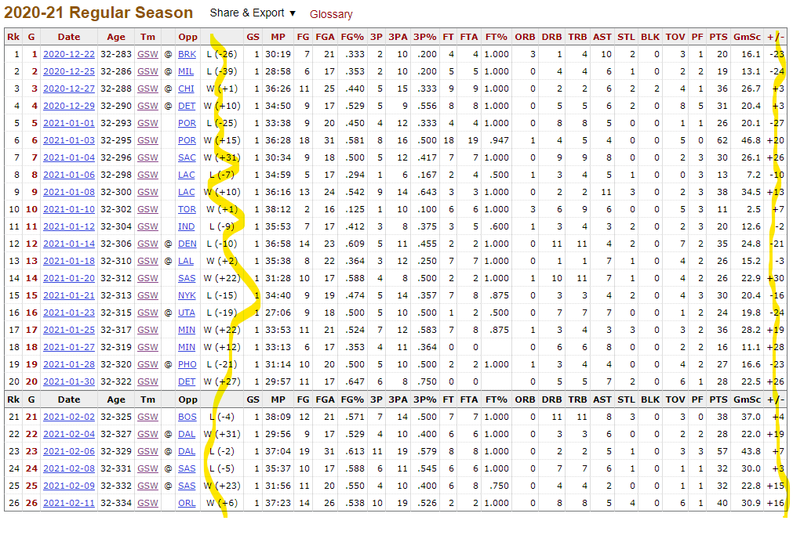

## NBA One Offs

Collection of scripts for doing quick analytical tasks for NBA stats

## Installation and Use

I wrote the scripts on Python 3.8.6 and using the libraries found in `requirements.txt`.

To use this code, download Python however is most appropriate for your OS, then install the needed library code with

`python -m pip install -r requirements.txt`

### Plus-Minus and Margin Corr

Simple script that takes a `gamelog` URL from [basketball-reference.com](https://www.basketball-reference.com/) and pulls the stat box for the current season. Then it does a bit of regex magic to extract their `+/-` and the team's win/loss margin and returns the correlation between the two.

Call it with

`python plus_minus_corr.py [PASTED URL]`

For instance, I sat down to write this because when I looked at Steph Curry's early-season statbox, the relationship between his `+/-` and the Warriors' win margin was pretty pronounced, *visually*




Now, [what constitutes a "good" correlation coefficient](https://statisticsbyjim.com/basics/correlations/) really depends on your domain. It's as low as `.4` in some applications, while north of `.95` in others. Regardless, I expected it to be high, but not *this* high, lol

```
$ python plus_minus_corr.py https://www.basketball-reference.com/players/c/curryst01/gamelog/2021/
0.9184385517782597
```

